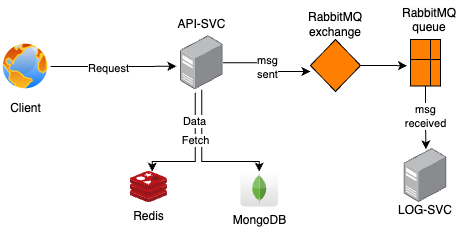

## Building a Scalable and Secure API
 #### Architecture
 
 
#### Workflow Summary
- Request Handling: The client sends a request to the server.
- Data Fetching: The server first attempts to retrieve the data from Redis. If the data is not found in the cache, it fetches it from MongoDB.
- Messaging: After processing the request, the server sends a message to RabbitMQ to notify other components or services about the action performed or the data update.
- Asynchronous Processing: RabbitMQ routes the message to the intended recipient for further actions (i.e. in this case its a simple `console.log` in `log-svc`), ensuring decoupled and asynchronous communication.

#### Steps to Deploy on your Local
> download or git clone the repository
> create a `.env` file inside `api-svc/src/config`
```
PORT=3001
MONGODB_CONNECTION_STRING=mongodb://mongo_db:27017/users
JWT_SECRET_KEY=<enter your secret key>
REDIS_HOST=redis_db
REDIS_PORT=6379
AMQP_URL=amqp://rabbitmq
```
> create a `.env` file inside `log-svc/src/config`
```
PORT=3002
AMQP_URL=amqp://rabbitmq
```
> inside the Assignment directory run the following command to start the application
`docker compose up -d`
> Check logs of the application using the following command
`docker compose logs -f --tail=20`

Following image is what you should see in your terminal when you run the above command
 
 
 Logs can also be seen in docker Desktop, simply click any container running in the container section
 attaching image for refrence
  
  
   
 #### Performance / Load testing of APIs
 
 Please check this report - [https://gh879tsd67tjb.s3.ap-south-1.amazonaws.com/report.pdf](https://gh879tsd67tjb.s3.ap-south-1.amazonaws.com/report.pdf)
 
 The performance of APIs was done using postman by running the collection in peak mode
 

 #### Status of unit test
 
 
 #### Deployment to AWS
 An `Nginx` reverse proxy has been setup on an AWS EC2 t2.medium instance allows you to forward traffic from port 80 (HTTP) to port 3001, where your application is running. This configuration helps mask the internal port, enhance security, and enable easier access for users through a standard web port.
 
 Attaching images for running apis after deployment using server public IP
 
 
 
 
 #### Accessing Swagger on local
 Open this URL in your browser after deploying the application
 > http://localhost:3001/api-docs
 
 You should see something like this -
 
 
 
 
